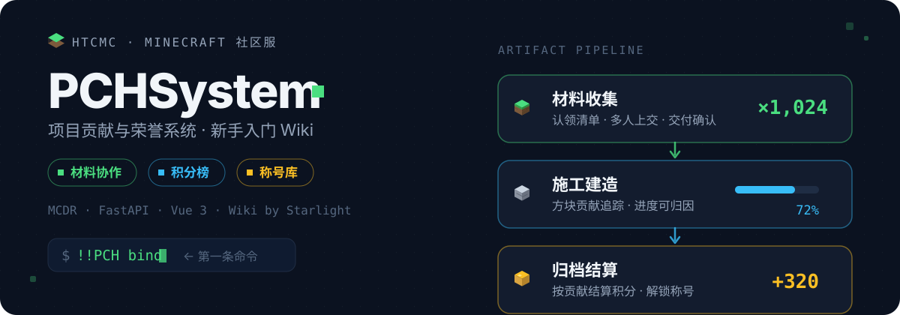

<p align="center">
  
</p>

# PCHSystem Wiki

HTCMC 社区服 **PCHSystem** 的新手入门 Wiki，面向玩家介绍系统功能和使用方法。

## 技术栈

- **框架**: [Astro Starlight](https://starlight.astro.build/)
- **部署**: GitHub Pages
- **语言**: 简体中文

## 本地开发

```bash
npm install
npm run dev      # 本地预览 http://localhost:4321
npm run build    # 构建到 dist/
```

## 目录结构

```
src/content/docs/
├── index.mdx              # 首页（落地页）
├── guide/                 # 新手指南
│   ├── getting-started.md
│   ├── bind-account.md
│   ├── submit-materials.md
│   └── web-dashboard.md
├── gameplay/              # 玩法说明
│   ├── project-lifecycle.md
│   ├── scoring.md
│   ├── titles.md
│   └── construction.md
├── commands/              # 命令手册
│   ├── quick-reference.md
│   ├── sheet-commands.md
│   └── construction-commands.md
├── faq.md                 # 常见问题
└── about.md               # 关于
```

## 相关仓库

- [PCHSystem](https://github.com/YuShenLiu06/PCHSystem) — 主项目（后端 / 前端 / MCDR 插件）

## License

MIT
