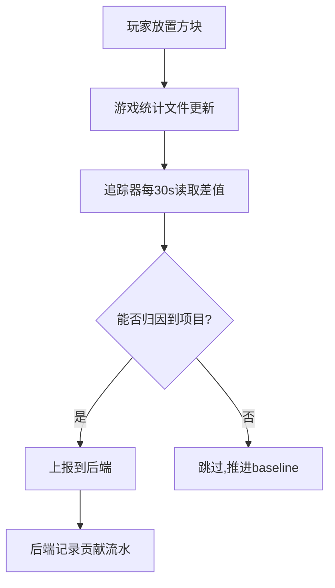

## 概述

项目进入施工阶段后，PCHSystem 会自动追踪每位参与者的方块放置贡献。目前使用 **统计文件差值** 方式追踪（读取 `world/stats/<uuid>.json` 的 `minecraft:used` 差值）。

## 加入施工

认领材料或上交材料时会**自动加入**施工；仅"纯放方块"（无认领/无上交）的玩家需手动加入：

```
!!PCH construction join [sheet_id]
```

- 不带编号：自动加入唯一进行中的项目
- 带编号：加入指定项目

## 查看状态

```
!!PCH construction status
```

显示：
- 追踪器是否启用
- 当前在线玩家数
- 当前施工项目数
- 上次上报结果

## 退出施工

```
!!PCH construction leave
```

## 查看当前施工

```
!!PCH construction current
```

显示你当前加入的施工项目。

## 工作原理



:::warning[注意事项]
1. 只能同时加入 **一个** 施工项目
2. 如果多个项目同时进行且无法自动判断归属，需要指定 `sheet_id`
3. 未来将支持客户端 mod 精确追踪（开发中）
:::

## 客户端 Mod 追踪（规划中）

未来将支持客户端 mod 通过 JWT 认证精确上报放置位置和方块类型，比统计文件差值更准确：

- `!!PCH construction switch` — 切换上报源
- `!!PCH mod-token` — 获取 mod JWT 令牌

:::note[当前状态]
默认追踪器已就绪（v0.9.0）：自动追踪 + 按玩家路由 + join/leave/current 命令。
客户端 mod 精确追踪为后续迭代内容。
:::
