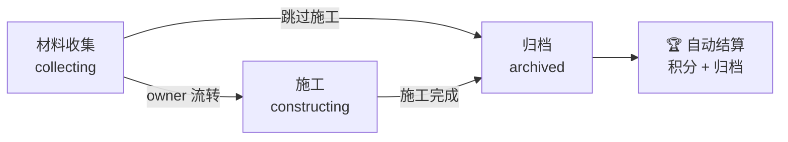

每个项目都经历三个阶段：**材料收集 → 施工 → 归档**。

## 阶段流程图

## 1. 材料收集（collecting）

项目立项后的初始阶段。

**核心任务**：
- 导入投影 / 蓝图 → 自动生成材料清单与积分池
- 玩家认领材料、上交物资
- 负责人维护清单（增删改材料行）

**操作**：
- 认领行：`[认领]` 按钮
- 上交材料：`!!PCH sheet submit`
- 查看进度：`!!PCH sheet view`

## 2. 施工（constructing）

材料备齐后进入施工阶段。

**核心任务**：
- 参与者放置方块建造
- 系统自动追踪每位玩家的放置贡献
- 项目负责人管理施工人员

**操作**：
- 加入施工：`!!PCH construction join [sheet_id]`
- 查看状态：`!!PCH construction status`
- 退出施工：`!!PCH construction leave`

:::note[施工追踪]
系统默认使用统计文件差值来追踪方块放置。确保你在施工前先 `join` 对应项目，否则贡献可能无法正确归因。
:::

## 3. 归档（archived）

项目完结的最终状态。

**自动完成**：
- 📝 生成归档文档（含贡献者精确排行）
- 📊 渲染贡献占比饼图
- 🔒 项目转为只读（不可再修改）
- 🏆 积分结算（积分体系就绪后自动执行）

**归档后**：
- 归档内容推送到 Wiki（wiki.js 双向同步，配置后自动）
- 任何人可查看归档记录
- 负责人可一键复用项目配置开新项目

## 负责人特权

| 操作 | 说明 |
|------|------|
| 流转阶段 | `!!PCH sheet advance <编号>` — 推进到下一阶段 |
| 直接归档 | 跳过施工直接归档 |
| 打回提交 | 有问题的交付打回返工 |
| 协管员管理 | 指定其他玩家协助管理 |
| 删除项目 | 管理员操作，需谨慎 |
